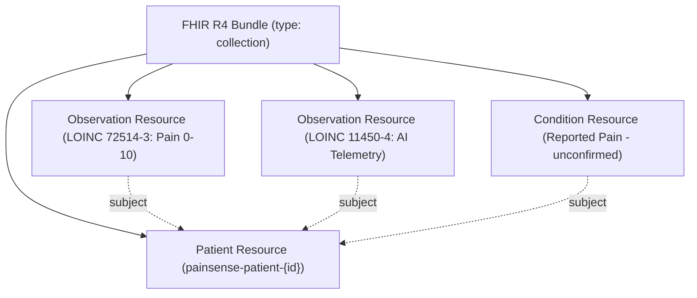

# HL7 FHIR R4 Interoperability & Coding Specification

**System Version:** 1.2.0-Enterprise  
**Standard:** HL7 FHIR Release 4 (R4) — Specification v4.0.1  
**Resource Format:** `application/fhir+json` Bundle (`type: collection`)  

---

## 1. Overview & Clinical Context

PAINSENSE-AI provides seamless electronic health record (EHR) interoperability by transforming multimodal pain assessments into standardized **HL7 FHIR Release 4 (R4)** compliant resource bundles. This enables integration into clinical workflows across hospital EHR systems such as Epic Systems, Oracle Health (Cerner), Meditech, and AthenaHealth.

All clinical outputs strictly enforce non-diagnostic boundaries: observational telemetry is categorized under `Observation`, subjective pain is captured under LOINC `72514-3`, and condition verification status is hardcoded to `unconfirmed`.

---

## 2. Standardized Medical Coding Systems

### 2.1 LOINC (Logical Observation Identifiers Names and Codes)
| LOINC Code | Code Display | FHIR Resource | Usage in PAINSENSE-AI |
| :--- | :--- | :--- | :--- |
| **72514-3** | Pain severity - 0-10 verbal numeric rating score | `Observation` | Primary standardized numeric pain rating ($0 \text{ to } 10$). Stored in `valueInteger`. |
| **11450-4** | Problem list - Reported | `Observation` | Multimodal AI supportive observation aggregating facial, vocal, and sign indicators. |
| **88020-3** | Functional assessment score | `Observation` | Composite motor guarding and posture mobility index. |

### 2.2 SNOMED-CT (Systematized Nomenclature of Medicine -- Clinical Terms)
Anatomical body sites are mapped to standard SNOMED-CT concept identifiers:

| Anatomical Site | SNOMED-CT Concept ID | Fully Specified Name |
| :--- | :--- | :--- |
| **Chest / Thorax** | `261179002` | Thoracic structure (body structure) |
| **Lower Back / Lumbar**| `82834004` | Lumbar spine structure (body structure) |
| **Head / Cranium** | `69536005` | Head structure (body structure) |
| **Abdomen / Epigastric**| `818983003` | Abdomen structure (body structure) |
| **Knee** | `72696002` | Knee joint structure (body structure) |
| **Shoulder** | `16953009` | Shoulder joint structure (body structure) |
| **Unspecified** | `385432009` | Not specified (qualifier value) |

### 2.3 HL7 Terminology & ValueSets
- **Observation Category:** `http://terminology.hl7.org/CodeSystem/observation-category` (`vital-signs` and `exam`).
- **Condition Verification Status:** `http://terminology.hl7.org/CodeSystem/condition-ver-status` (`unconfirmed`).
- **Observation Interpretation:** `http://terminology.hl7.org/CodeSystem/v3-ObservationInterpretation` (`CR` for Critical, `A` for Abnormal, `N` for Normal).

---

## 3. Resource Architecture in FHIR Bundle



---

## 4. RESTful API Endpoint

```http
GET /api/assessment/{id}/fhir
Accept: application/fhir+json
Authorization: Bearer <JWT_ACCESS_TOKEN>
```

### Response Example:
```json
{
  "resourceType": "Bundle",
  "id": "painsense-bundle-12",
  "type": "collection",
  "timestamp": "2026-09-30T10:15:00Z",
  "entry": [
    {
      "fullUrl": "urn:uuid:patient-1",
      "resource": {
        "resourceType": "Patient",
        "id": "painsense-patient-1",
        "identifier": [
          {
            "system": "urn:ietf:rfc:3986",
            "value": "urn:uuid:painsense-user-1"
          }
        ],
        "active": true,
        "name": [{ "use": "usual", "text": "Alex Morgan" }]
      }
    },
    {
      "fullUrl": "urn:uuid:obs-pain-intensity-12",
      "resource": {
        "resourceType": "Observation",
        "id": "obs-pain-intensity-12",
        "status": "final",
        "category": [
          {
            "coding": [{
              "system": "http://terminology.hl7.org/CodeSystem/observation-category",
              "code": "vital-signs",
              "display": "Vital Signs"
            }]
          }
        ],
        "code": {
          "coding": [{
            "system": "http://loinc.org",
            "code": "72514-3",
            "display": "Pain severity - 0-10 verbal numeric rating score"
          }]
        },
        "subject": { "reference": "urn:uuid:patient-1" },
        "valueInteger": 6,
        "bodySite": {
          "coding": [{
            "system": "http://snomed.info/sct",
            "code": "261179002",
            "display": "Thoracic structure (body structure)"
          }],
          "text": "Chest"
        }
      }
    },
    {
      "fullUrl": "urn:uuid:condition-symptom-12",
      "resource": {
        "resourceType": "Condition",
        "id": "condition-symptom-12",
        "clinicalStatus": {
          "coding": [{
            "system": "http://terminology.hl7.org/CodeSystem/condition-clinical",
            "code": "active"
          }]
        },
        "verificationStatus": {
          "coding": [{
            "system": "http://terminology.hl7.org/CodeSystem/condition-ver-status",
            "code": "unconfirmed"
          }]
        },
        "category": [{ "text": "Reported Symptom Presentation" }],
        "subject": { "reference": "urn:uuid:patient-1" },
        "code": { "text": "Reported Pain Presentation in Chest" },
        "note": [{ "text": "AI-generated observational handover — not a medical diagnosis." }]
      }
    }
  ]
}
```

---

## 5. Security & Tenant Validation

- Requests to `/api/assessment/{id}/fhir` are protected by `verify_patient_access`.
- Patient users can only export their own records.
- Caregivers can only export records for patients with an active `CaregiverPatientLink`.
- Unauthorized requests return `403 Forbidden`.
