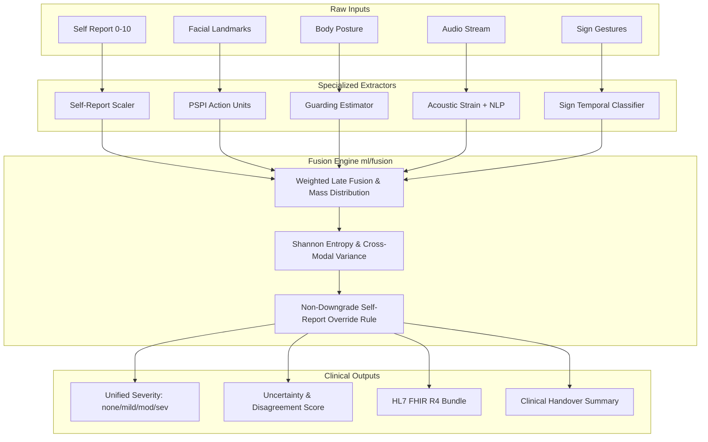

# Research Methodology & Theoretical Foundations

**Project:** PAINSENSE-AI — Multimodal Pain Detection & Healthcare Assistance System  
**Version:** 1.2.0-Enterprise  

---

## 1. Introduction & Theoretical Motivation

Pain is inherently a multidimensional, subjective experience defined by the International Association for the Study of Pain (IASP) as:
> *"An unpleasant sensory and emotional experience associated with, or resembling that associated with, actual or potential tissue damage."*

In non-communicative or vulnerable populations (e.g., intubated patients, non-verbal individuals, post-stroke patients, or Deaf/hard-of-hearing individuals), relying solely on spoken communication fails. PAINSENSE-AI employs a multimodal observational architecture designed to augment clinical triage without ever substituting human clinician diagnostic authority.

---

## 2. Mathematical Formulations by Modality

### 2.1 Facial Pain Expression: Prkachin & Solomon Pain Intensity (PSPI)
The system adopts the clinically validated Facial Action Coding System (FACS) metric formalized by Prkachin and Solomon (2008):

$$\text{PSPI} = \text{AU4} + \max(\text{AU6}, \text{AU7}) + \max(\text{AU9}, \text{AU10}) + \text{AU43}$$

Where:
- **AU4 (Brow Lowerer):** Quantified by the vertical contraction between landmark pairs $(66, 296)$ and nasion $(168)$ normalized by inter-ocular distance $D_{\text{ocular}} = \|P_{33} - P_{263}\|_2$:
  $$\text{AU4} = 1.0 - \frac{\|P_{66} - P_{168}\|_2 + \|P_{296} - P_{168}\|_2}{2 \cdot D_{\text{ocular}}}$$
- **AU6 / AU7 (Cheek Raiser & Lid Tightener):** Measured as the palpebral fissure height reduction:
  $$\text{AU6/7} = 1.0 - \frac{\|P_{159} - P_{145}\|_2 + \|P_{386} - P_{374}\|_2}{2 \cdot D_{\text{interpupillary}}}$$
- **AU9 / AU10 (Nose Wrinkler & Upper Lip Raiser):** Evaluated from nasolabial distance and mouth elevation.
- **AU43 (Eye Closure):** Binary or continuous proportion of eye aperture closure exceeding $75\%$.

### 2.2 Vocal Biomarker Acoustics & Strain Formulation
Acoustic pain expression induces involuntary constriction of the vocal tract and respiratory muscles, causing fundamental frequency shifts and perturbation.
- **Pitch Jitter (Frequency Perturbation):**
  $$\text{Jitter} = \frac{\frac{1}{N-1} \sum_{i=1}^{N-1} |T_i - T_{i+1}|}{\frac{1}{N} \sum_{i=1}^{N} T_i}$$
- **Shimmer (Amplitude Perturbation):**
  $$\text{Shimmer} = \frac{\frac{1}{N-1} \sum_{i=1}^{N-1} |A_i - A_{i+1}|}{\frac{1}{N} \sum_{i=1}^{N} A_i}$$
- **Vocal Strain Index ($S_v$):**
  $$S_v = \sigma\left(0.40 \cdot \hat{F}_0 + 0.30 \cdot \text{Jitter} + 0.20 \cdot \text{Shimmer} + 0.10 \cdot \Phi_{\text{flux}}\right)$$
  where $\sigma(z) = \frac{1}{1 + e^{-z}}$ is the logistic sigmoid mapping to $[0, 1]$.

### 2.3 Sign-Language Spatial-Temporal Gesture Modeling
Hand landmarks $\mathbf{L} = \{(\tilde{x}_i, \tilde{y}_i, \tilde{z}_i)\}_{i=0}^{20}$ are centered on the wrist landmark $P_0$ and scale-normalized by palm radius $R_{\text{palm}} = \|P_9 - P_0\|_2$:
$$\mathbf{L}'_i = \frac{P_i - P_0}{R_{\text{palm}}}$$

Temporal velocity over sliding window $T=15$ frames:
$$\mathbf{v}_t = \frac{1}{T-1} \sum_{k=1}^{T-1} \frac{\|\mathbf{L}'_{t-k+1} - \mathbf{L}'_{t-k}\|_2}{\Delta t}$$

---

## 3. Multimodal Evidential Fusion Architecture



### 3.1 Mathematical Fusion Equation
For $M$ active modalities with base weights $w_m$ and severity belief vectors $\mathbf{s}_m \in [0, 1]^K$ ($K=4$ classes: `none`, `mild`, `moderate`, `severe`):
$$\mathbf{S}_{\text{fused}} = \sum_{m \in \mathcal{M}} w'_m \mathbf{s}_m, \quad \text{where } w'_m = \frac{w_m}{\sum_{j \in \mathcal{M}} w_j}$$

### 3.2 Cross-Modal Disagreement Metric ($\Delta_{\text{modal}}$)
$$\Delta_{\text{modal}} = \frac{1}{|\mathcal{M}|(|\mathcal{M}|-1)} \sum_{i \in \mathcal{M}} \sum_{j \in \mathcal{M}, j \ne i} \|\mathbf{s}_i - \mathbf{s}_j\|_1$$

### 3.3 Evidential Uncertainty ($\mathcal{U}$)
Combining normalized Shannon entropy with modal disagreement:
$$\mathcal{U} = 0.5 \cdot \left(-\frac{1}{\ln K} \sum_{k=1}^K S_k \ln(S_k + \epsilon)\right) + 0.5 \cdot \Delta_{\text{modal}}$$

---

## 4. Safety Override Constraint & Proof of Non-Downgrade

**Theorem (Patient Primacy):**  
Let $S_{\text{report}} \in \{\text{none}, \text{mild}, \text{moderate}, \text{severe}\}$ be the patient's explicit report. Let $S_{\text{passive}}$ be the combined estimate from passive sensors (facial and acoustic). The final triage recommendation $S_{\text{final}}$ must satisfy:
$$\text{Rank}(S_{\text{final}}) \ge \text{Rank}(S_{\text{report}})$$

**Implementation Rule (`ml/fusion/fusion_engine.py`):**
```python
if self_report_severity in ["moderate", "severe"]:
    if rank(fused_severity) < rank(self_report_severity):
        fused_severity = self_report_severity
        flags.append("SAFETY_OVERRIDE_SELF_REPORT_PRIMACY")
```
This ensures algorithmic passive signals never invalidate or suppress patient-expressed suffering.
