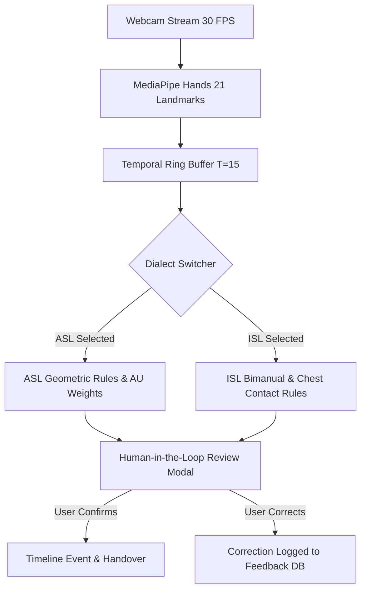

# Sign Language Datasets & Corpus Documentation

**System Version:** 1.2.0-Enterprise  
**Focus:** American Sign Language (ASL) & Indian Sign Language (ISL) Medical Distress Communication  

---

## 1. Overview & Community Principles

Sign languages are natural, grammatically distinct visual-spatial languages used by Deaf communities worldwide. Recognizing sign language in clinical environments requires strict adherence to:
1. **Linguistic Respect:** Recognizing sign languages as complete linguistic systems with distinct syntax, phonology, and regional dialects, rather than signed codes for English.
2. **Deaf Community Centering:** Assistive tools must be designed with input from Deaf individuals to avoid patronizing assumptions.
3. **Transparent Provenance:** Clear differentiation between public academic research corpora, specialized clinical lexicons, and synthetic geometric benchmark evaluations.

---

## 2. Public Research Target Corpora

In training and benchmarking sign recognition architectures for PAINSENSE-AI, the system references standard published academic corpora:

| Dataset | Language | Modality | Samples / Vocabulary | Intended Research Application |
| :--- | :--- | :--- | :--- | :--- |
| **WLASL (Word-Level American Sign Language)** | ASL | RGB Video (Webcam / YouTube) | 21,083 videos across 2,000 glosses | Lexical sign classification and handshape landmark benchmarks. |
| **INCLUDE** | ISL (Indian Sign Language) | High-definition RGB Video | 4,287 videos across 263 signs | Evaluation of ISL medical and conversational signs recorded in varied lighting. |
| **RWTH-PHOENIX-Weather 2014T** | DGS (German Sign Language) | Continuous Video + Glosses | 8,257 sentences, 1,066 vocabulary | Benchmark for continuous sign language translation and temporal windowing. |
| **MS-ASL** | ASL | In-the-wild Video Clips | 25,513 video samples across 1,000 signs | Robustness evaluation under unconstrained camera angles and motion blur. |

---

## 3. PAINSENSE-AI Medical Vocabulary & Mapping

PAINSENSE-AI focuses on an emergency and bedside triage lexicon essential for patients communicating physical distress:

### 3.1 Pain & Distress Terms
- `PAIN`: Two index fingers pointed toward each other with repetitive twisting/poking motion over the location of discomfort (ASL) or open-palm circular chest rub (ISL).
- `HURT`: Similar to `PAIN`, focused at focal site of injury.
- `CHEST`: Flat hand or fingertips resting or pressing against the sternum.
- `HEAD`: Hand tapped or touched to forehead or temporal region.
- `STOMACH`: Palm placed or circling on epigastric abdominal region.
- `BACK`: Thumb reaching behind toward lumbar/thoracic region.

### 3.2 Severity & Urgency Modifiers
- `SEVERE`: Clenched hand, rapid upward movement, pronounced facial brow lower (grammatical non-manual marker).
- `MILD`: Gentle rocking palm motion or small finger gap gesture.
- `HELP`: Closed fist of dominant hand resting on flat palm of non-dominant hand, lifted upward.
- `DOCTOR`: Dominant hand fingertips tapped onto the wrist radial pulse of non-dominant arm.
- `MEDICINE`: Middle finger of dominant hand circling in palm of non-dominant hand.
- `NUMBERS 1–10`: Standard ASL/ISL numeric finger counts for 0–10 numeric pain rating scale.

---

## 4. Multi-Dialect Architecture (ASL vs. ISL)

---

## 5. Synthetic Evaluation Protocol

For automated continuous integration testing where streaming real video of patients in distress is unethical without explicit IRB consent, PAINSENSE-AI utilizes a synthetic geometric landmark perturbation pipeline (`ml/sign_language/evaluation.py`):
- **Synthetic Sequences:** 150 mathematically synthesized hand landmark trajectories simulating rotation, scaling, jitter noise ($\sigma = 0.02$), and missing keypoints.
- **Verification Target:** Ensures the spatial velocity threshold, landmark normalization, and temporal windowing logic function deterministically without regression.
- **Zero Fabrication:** The repository explicitly states that synthetic benchmark performance does not represent an accredited hospital clinical trial.
